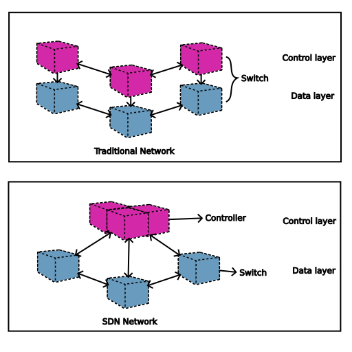
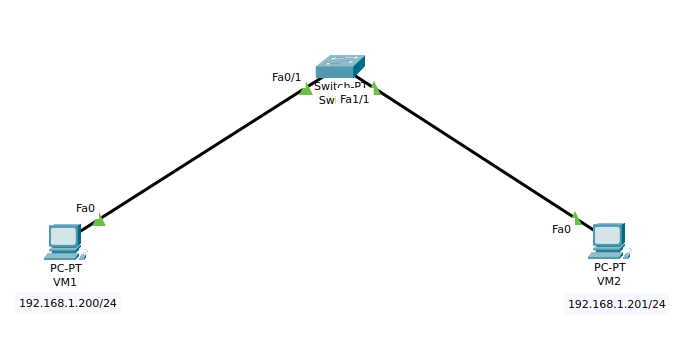
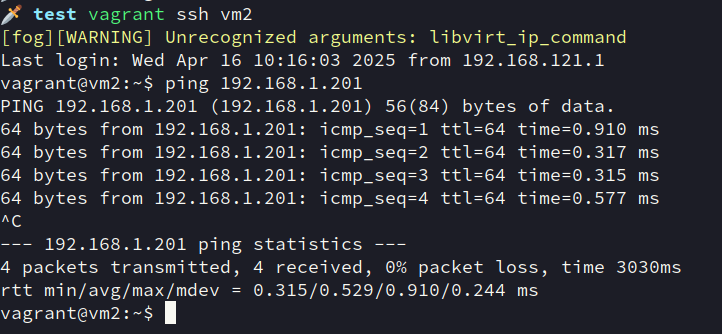
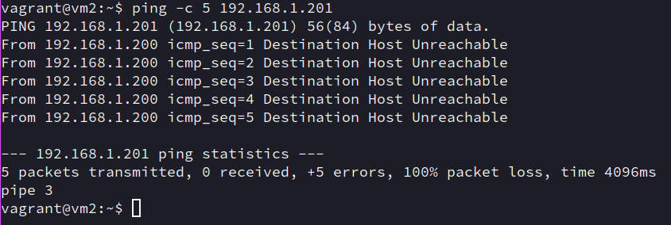

# SDN
SDN, Software Define Network, 软件定义网络 (后面解释为什么叫这个名字). 核心有两点:
- 控制平面和数据平面分离 (本质上是逻辑集中控制, 把交换机的控制平面抽象为单一的控制器)
- 开放的编程接口 (提供与交换机交互的编程接口)

需要注意, SDN 不是一个具体的协议或者实现, 而是一种架构理念, 只要满足上述特征都可以称为 SDN.

下面图对比传统网络架构和 SDN 架构:


在 SDN 中, 可以把交换机视为没有 control plane 的纯粹的转发设备, 其转发操作根据 "流表" (后续提及) 进行.

流表, 可以视为一个 Match-Action 表, 交换机保存在本地, 由 controller 进行 ADD, DELETE, MODIFY 等控制.

## 流表示例
为了直观体会, 这里用 Open vSwitch 以及 vagrant 虚拟机做演示, 如果是在 Archlinux 上, 安装为:
```sh
sudo pacman -S openvswitch libvirt vagrant
sudo systemctl start ovsdb-server
sudo systemctl start ovs-vswitchd
```
可能还有其他依赖, 可以根据报错安装.

这里的示例, 通过创建一个 OpenFlow 交换机 (什么是 OpenFlow 在下一节讲), 给交换机添加两个 `ports`, 分别连接一个虚拟机 (`vm1` 和 `vm2`), 给 `ports` 分配 IP 地址之后, 通过更改流表测试连通性. 结构大致为:


### 交换机和接口设置
创建一个虚拟交换机 (也可以叫网桥):
```sh
$ sudo ovs-vsctl add-br ovs-br0
```

查看默认流表项:
```sh
$ sudo ovs-ofctl dump-flows ovs-br0
 cookie=0x0, duration=64.168s, table=0, n_packets=24, n_bytes=3690, priority=0 actions=NORMAL
```

添加两个接口:
```sh
$ sudo ovs-vsctl add-port ovs-br0 eth1 tag=10 -- set interface eth1 type=internal
$ sudo ovs-vsctl add-port ovs-br0 eth2 tag=10 -- set interface eth2 type=internal
```

### 虚拟机设置
创建 Vagrantfile, 内容为:
```ruby
Vagrant.configure("2") do |config|
  config.vm.provider :libvirt do |libvirt|
    libvirt.driver = "kvm"
    libvirt.management_network_name = "default"  # 使用默认 NAT 网络
  end

  # 虚拟机 vm1 配置
  config.vm.define "vm1" do |vm1|
    vm1.vm.box = "generic/ubuntu2204"
    vm1.vm.hostname = "vm1"
    
    # 桥接到 OVS 的 eth1 接口
    vm1.vm.network :public_network,
      :dev => "eth1",       # 对应 OVS 网桥名称
      :mode => "bridge", 
      :virtualport_type => "openvswitch"
  end

  # 虚拟机 vm2 配置
  config.vm.define "vm2" do |vm2|
    vm2.vm.box = "generic/ubuntu2204"
    vm2.vm.hostname = "vm2"
    
    # 桥接到 OVS 的 eth2 接口
    vm2.vm.network :public_network,
      :dev => "eth2",       # 对应 OVS 网桥名称
      :mode => "bridge",
      :virtualport_type => "openvswitch"
  end
end
```

若以 libvirt 为 provider, 需要安装插件:
```sh
VAGRANT_DISABLE_STRICT_DEPENDENCY_ENFORCEMENT=1 vagrant plugin install vagrant-libvirt
```

启动:
```sh
vagrant up
```

之后可以用:
```sh
vagrant ssh vm1
vagrant ssh vm2
```

登录.

### 测试
先给两个虚拟机的网卡配置 IP:
```sh
vagrant ssh vm1
sudo ip addr add 192.168.1.200/24 dev eth1
exit
vagrant ssh vm2
sudo ip addr add 192.168.1.201/24 dev eth1
ping 192.168.1.200
```

结果如:


能够 ping 通.

此时添加流表项, 丢弃所有来自 `eth2` 的包, 可以通过:
```sh
sudo ovs-ofctl show ovs-br0
OFPT_FEATURES_REPLY (xid=0x2): dpid:0000460d35d08042
n_tables:254, n_buffers:0
capabilities: FLOW_STATS TABLE_STATS PORT_STATS QUEUE_STATS ARP_MATCH_IP
actions: output enqueue set_vlan_vid set_vlan_pcp strip_vlan mod_dl_src mod_dl_dst mod_nw_src mod_nw_dst mod_nw_tos mod_tp_src mod_tp_dst
 3(eth1): addr:ea:77:78:bb:7b:8d
     config:     0
     state:      0
     speed: 0 Mbps now, 0 Mbps max
 4(eth2): addr:2a:ed:a0:41:41:15
     config:     0
     state:      0
     speed: 0 Mbps now, 0 Mbps max
 LOCAL(ovs-br0): addr:46:0d:35:d0:80:42
     config:     0
     state:      0
     speed: 0 Mbps now, 0 Mbps max
OFPT_GET_CONFIG_REPLY (xid=0x4): frags=normal miss_send_len=0
```

查看 `eth2` 的 port number, 这里为 `4`.

添加流表项:
```sh
sudo ovs-ofctl add-flow ovs-br0 "priority=100, in_port=4, actions=drop"
```
- 每个流表项有优先级, 值越大, 越先匹配, `in_port` 只数据包从哪个端口进入交换机, `actions` 指定对数据包的行为

之后登入 `vm2` 尝试:
```sh
ping 192.168.1.200
```


此时无法 `ping` 通. 符合假设的结果

# 结语
对于 SDN 网络的仿真有很多开源平台, 比如 Mininet (后面会专门讲), 这里用虚拟机主要是大家比较熟悉.
