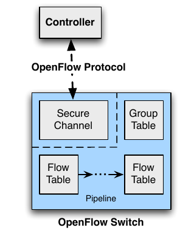
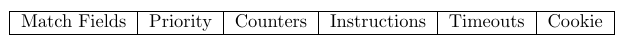
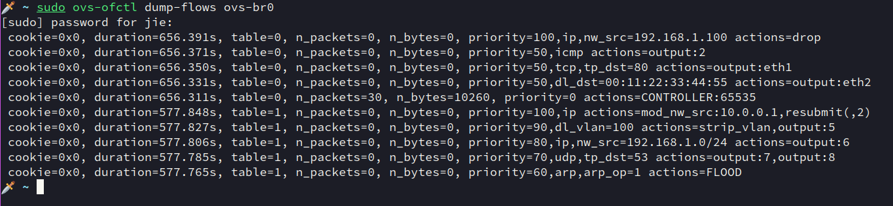
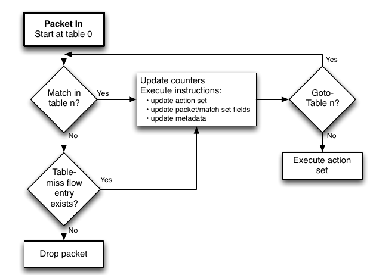
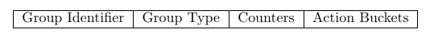

# OpenFlow
在 SDN 体系下, controller 与 switch 之间的通信协议称为 "Southbound API" (南向接口), 而 OpenFlow 则是一个广泛使用的南向接口协议标准, 其定义了控制器如何配置和管理交换机的流表. (其他协议如 `OVSDB`, `P4Runtime` 等)

- Open, 意味着开放, 其提供了可编程接口.
- Flow, 表明其基于 `Flow` 传输数据 (可以简单视为一组数据包的集合)

OpenFlow 的详尽信息, 可以在 ONF 的白皮书上查看, `1.0.1` 版本的获取方法如下:
```sh
wget https://opennetworking.org/wp-content/uploads/2013/02/conformance-test-spec-openflow-1.0.1.pdf
```

这里不会讲解全部的概念, 仅作入门参考吧, 主要内容也来自于上述文档.

## 结构
能通过 OpenFlow 与 controller 通信的都可以称为 OpenFlow switch, 其结构如下:



- Secure Channel 可以直接通过 TCP 连接, 也常用 TLS 加密. 在 Channel 中传递的消息可以分为 3 类:
    * controller-to-switch, 由 controller 发起, 直接管理或查看 switch 状态
    * asynchronous, 由 switch 发起, 向 controller 上传信息更新状态
    * symmetric, switch 和 controller 都能发起
- Flow Table, 其中包含 flow entries, 用于对数据包进行匹配和执行 actions (后面细讲)
- Group Table, 包含 group entries, 用于对数据包进行多组 actions 操作 (后面细讲)

## Flow table
在 OpenFlow switch 中, 可以有多个 flow table, 编号从 `0` 开始, 每个 flow table 有多条 flow entries, 每个 flow entry 由 match fields, counters, 和一组 instructions 组成, 结构如下:


- match fields, 定义字段来匹配数据包, 如 `in_port`, `eth_type`
- priority, 解决多个流表条目同时匹配时的冲突, 优先级高的条目优先执行 (数值越大, 优先级越高, 若优先级相同, 具体由交换机实现决定)
- count, 统计匹配该流表条目的数据包数, 字节数等, 用于监控和分析, 如 `packet_count`, `byte_count`, `duration`
- instructions, 指定 actions 或修改 pipline (指多个 flow table 传递) 处理流程, 如:
    * `Apply-Actions`, 立即执行 actions
    * `Write-Actions`, 更新 actions
    * `Goto-Table`, 跳转到指定 flow table
    * `Clear-Actions`, 清除 actions
- timeouts, 控制流表条目的生命周期, 避免无效条目长期占用资源, 分
    * `idle timeout`, 若在指定时间内无匹配数据包, 则删除条目
    * `hard timeout`, 无论是否有流量, 到达时间后强制删除
- Cookie, 控制器定义的, 每一个 flow table entry 的标识符


这里同样用 Open vSwitch 做示例, 命令的详细说明见 `2_OpenvSwitch` 章节.

添加 10 条 flow entries, `table 0` 和 `table 1` 各包含 5 条:
```sh
sudo ovs-vsctl add-br ovs-br0
flow_entries=("table=1, priority=100, ip, actions=mod_nw_src:10.0.0.1,goto_table:2" "table=1, priority=90, dl_vlan=100, actions=strip_vlan,output:5" "table=1, priority=80, ip, nw_src=192.168.1.0/24, actions=output:6" "table=1, priority=70, udp, tp_dst=53, actions=output:7,output:8" "table=1, priority=60, arp, arp_op=1, actions=FLOOD" "table=0, priority=100, ip, nw_src=192.168.1.100, actions=drop" "table=0, priority=50, icmp, actions=output:2" "table=0, priority=50, tcp, tp_dst=80, actions=output:3" "table=0, priority=50, dl_dst=00:11:22:33:44:55, actions=output:4" "table=0, priority=0, actions=CONTROLLER:65535")
for entity in ${flow_entries[@]}
do
    sudo ovs-ofctl add-flow ovs-br0 "${entity}"
done
sudo ovs-ofctl dump-flows ovs-br0
```



流表的匹配流程如下:



从 flow table 0 开始, 其内的 flow entries 按优先级排列进行匹配, 第一个匹配的 entry 用于处理数据包. 即执行其 instructions. 如果没有匹配的 entry, 则由 table-miss 项进行处理 (如果配置了的话), 一般的操作是: 将数据包通过 openflow channel 发往 controller, 或丢弃, 或发送给另一个 flow table. `Table-miss`, 指一个数据包, 不匹配任何流表项时执行的操作.

Controller 对 switch 的控制主要体现在对流表的操控, 如 `ADD`, `DELETE`, `MODIFY`, 详细过程会在后续 Ryu 的篇章说明.

## Group Table
一个 group table 中包含一组 group entries, 每个 group entry 包含 Group ID (唯一标识), Group type (类型, 定义后不能动态修改), 多个 actions buckets, 以及其他属性. 要执行哪些 buckets 由 该 entry 的 group type 决定. 有 4 种 group type:
- `all` (`OFPGT_ALL`), 执行所有 buckets
- `select` (`OFPGT_SELECT`), 根据算法选择一个 bucket 执行
- `indirect` (`OFPGT_INDIRECT`), 执行单个 bucket (??)
- `fast failover` (`OFPGT_FF`), 按 buckets 的优先级顺序执行, 自动切换到下一个可用的 bucket

一个 group entry 的结构为:

- Group identifier 是一个 32 位无符号整数, 用于唯一标识该 entry
- Group type, 决定 action buckets 的执行逻辑
- Counters, 记录该 entry 处理的数据包和字节数
- Action buckets, 定义多个 action bucket, 每个 bucket 包含 action sets 和相关联的参数

由于这个我不常使用, 因此暂缓说明吧.

## OpenFlow ports
OpenFlow ports 指 OpenFlow switch 上能够被 SDN Controller 管理的逻辑接口, 可以用于:
- 接收/发送数据包, 来连接物理网络或其他设备
- 参与流表处理, 能作为匹配字段 (如 `in_port`)或 action target (如 `output:port`)

OpenFlow ports 分 3 类, 包括 Physical ports, logical ports, reserved ports.
- Physical ports, 对应物理设备接口, 如交换机的 `1G/10G` 以太网口, 用于连接主机, 路由器或其他交换机
- Logical ports, 无直接的物理映射, 如隧道端口, 链路聚合组等, 但本质上还是和 OpenFlow Physical ports 通信, 数据包的区别在于, metadata 中会有额外的字段, 如 Tunnel-ID 来指定
- Reserved ports, 预定义的逻辑端口, 有特殊语义, 如:
    * `OFPP_LOCAL`, 交换机的本地控制平面
    * `OFPP_CONTROLLER`, 对应与 SDN 控制器的 control channel
    * `OFPP_ALL`, 广播到所有物理端口
    * `OFPP_FLOOD`, 洪泛到除入端口外的所有端口
    * `OFPP_IN_PORT`, 将数据包送回入端口

同样用 Open vSwitch 距离, 在一个 OpenFlow switch 上创建两个 ports:
```sh
sudo ovs-vsctl add-br ovs-br0
sudo ovs-vsctl add-port ovs-br0 eth1 -- set interface eth1 type=internal
sudo ovs-vsctl add-port ovs-br0 eth2 -- set interface eth2 type=internal
sudo ovs-ofctl show ovs-br0
OFPT_FEATURES_REPLY (xid=0x2): dpid:00000afd293c9d45
n_tables:254, n_buffers:0
capabilities: FLOW_STATS TABLE_STATS PORT_STATS QUEUE_STATS ARP_MATCH_IP
actions: output enqueue set_vlan_vid set_vlan_pcp strip_vlan mod_dl_src mod_dl_dst mod_nw_src mod_nw_dst mod_nw_tos mod_tp_src mod_tp_dst
 1(eth1): addr:ea:77:78:bb:7b:8d
     config:     0
     state:      0
     speed: 0 Mbps now, 0 Mbps max
 2(eth2): addr:2a:ed:a0:41:41:15
     config:     0
     state:      0
     speed: 0 Mbps now, 0 Mbps max
 LOCAL(ovs-br0): addr:0a:fd:29:3c:9d:45
     config:     0
     state:      0
     speed: 0 Mbps now, 0 Mbps max
OFPT_GET_CONFIG_REPLY (xid=0x4): frags=normal miss_send_len=0
```

## OpenFlow Message
讲下常见的 OpenFlow Message. (waiting for implementing)


## OpenFlow channel
讲下 channel 建立的细节. (waiting for implementing)

# 结语
细节还是看白皮书吧, 这里只是简单讲了下对我来说比较重要的知识点.
