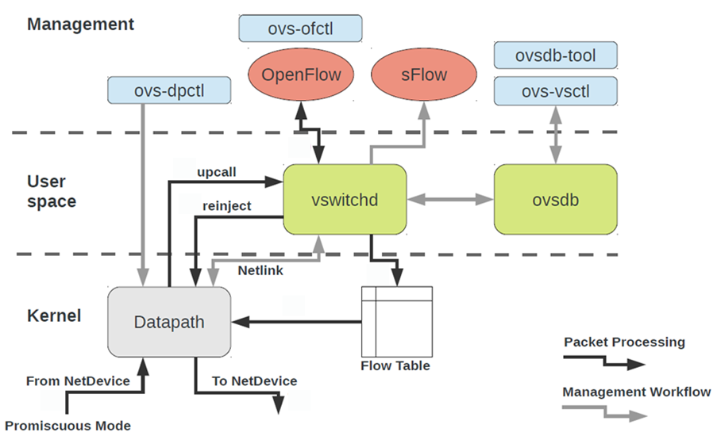

# Open vSwitch
[Open vSwitch 官方文档](https://docs.openvswitch.org/en/latest/intro/what-is-ovs/)

Open vSwitch 是一个开源的高性能软交换机 (软件模拟的交换机), 主要用于虚拟化环境和 SDN. 其完整支持 OpenFlow 协议 (1.0 到 1.5), 便于与 controller 集成.

## 结构


主要组件的基本使用如下.

### 安装
对于 Ubuntu/Debian, 安装为:
```sh
sudo apt-get install openvswitch-switch openvswitch-testcontroller openvswitch-common
```

对于 Archlinux, 安装为:
```sh
sudo pacman -S openvswitch
```

### ovs-vswitchd
`ovs-vswitchd`, Open vSwitch VSwitch Daemon, OVS 的守护进程, 负责管理 OVS 交换机的行为, 包括处理数据包的转发, 维护流表等.

```sh
sudo systemctl enable --now ovs-vswitchd.service
```

### ovsdb-server
`ovsdb-server`, Open vSwitch Database Server, OVS 的数据库服务器, 它存储了 OVS 的配置信息, 包括交换机端口, 流表等数据.

```sh
sudo systemctl enable --now ovsdb-server.service
```

### ovs-vsctl
`ovs-vsctl`, Open vSwitch VSwitch Control, 用于管理 OVS 交换机的配置, 可以创建, 删除, 修改交换机, 端口, 接口等

#### 查看 OVS 版本和接口信息
```sh
ovs-vsctl show
```

#### 创建 bridge
```sh
ovs-vsctl add-br br0
```

如果想让 OpenFlow table 一开始为空:
```sh
 ovs-vsctl add-br br0 -- set Bridge br0 fail-mode=secure
```

#### 为 bridge 添加 port
- 创建 normal port
```sh
ovs-vsctl add-port br0 eth0
```

- 创建 internal port
```sh
ovs-vsctl add-port br0 eth1 -- set Interface eth1 type=internal
```
- `ovs-vsctl add-port br0 eth1`, 用于在 `br0` 上添加名为 `eth1` 的 port
- `-- set interface eth1 type=internal` 设置 `eth1` 为 `internal` 类型

若要设置 OpenFlow 端口号, 如:
```sh
ovs-vsctl add-port br0 p1 -- set Interface ofport_request=1
```

#### 删除 bridge
```sh
ovs-vsctl del-br br0
```

#### 查询 bridge 列表
```sh
ovs-vsctl list-br
```

### ovs-ofctl
`ovs-ofctl`, Open vSwitch OpenFlow Control, 用于与 Open vSwitch 的流表进行交互, 可以添加, 修改, 删除流表项, 以及查询流表信息

#### 修改 port 状态
```sh
ovs-ofctl mod-port br0 eth1 up
```

#### 查看 bridge 状态
```sh
ovs-ofctl show br0
```

#### 为 bridge 添加 flow entry
```sh
ovs-ofctl add-flow br0 \
    "table=0, dl_src=01:00:00:00:00:00/01:00:00:00:00:00, actions=drop"
```
- `table=0`, 指定给那个 table 添加 entity
- `dl_src`, "Data Link source", 匹配 MAC 地址, `/01:00:00:00:00:00` 是掩码, 这里表示只匹配前 8 位

阻止 STP packets:
```sh
ovs-ofctl add-flow br0 \
    "table=0, dl_dst=01:80:c2:00:00:00/ff:ff:ff:ff:ff:f0, actions=drop"
```

将剩余 packets 转移到下一个 flow table:
```sh
ovs-ofctl add-flow br0 "table=0, priority=0, actions=resubmit(,1)"
```
- `resubmit(,1)`, 语法是 `resubmit([port], [table_id])`, 表示将数据包重新提交到另一个流表进行处理, `port` 表示数据包在重新提交时应该从哪个端口进入

#### 查看流表信息
```sh
ovs-ofctl dump-flows br0 table=0
```

输出如:
```
cookie=0x0, duration=995.747s, table=0, n_packets=4, n_bytes=336, priority=1,in_port="ap1-mp3",dl_src=6a:10:de:17:12:39,dl_dst=9e:29:4a:20:af:4d actions=output:"ap1-eth4"
cookie=0x0, duration=995.720s, table=0, n_packets=3, n_bytes=238, priority=1,in_port="ap1-eth4",dl_src=9e:29:4a:20:af:4d,dl_dst=6a:10:de:17:12:39 actions=output:"ap1-mp3"
cookie=0x0, duration=980.503s, table=0, n_packets=3, n_bytes=238, priority=1,in_port="ap1-mp3",dl_src=fe:af:1b:c2:da:e5,dl_dst=9e:29:4a:20:af:4d actions=output:"ap1-eth4"
cookie=0x0, duration=980.477s, table=0, n_packets=2, n_bytes=140, priority=1,in_port="ap1-eth4",dl_src=9e:29:4a:20:af:4d,dl_dst=fe:af:1b:c2:da:e5 actions=output:"ap1-mp3"
cookie=0x0, duration=1017.692s, table=0, n_packets=174, n_bytes=12124, priority=0 actions=CONTROLLER:65535
```
- `cookie` 是流表项标识符, 用于唯一标识一个流表项. 值为 `0x0` 标识未设置 `cookie`
- `duration` 是流表项在流表中已存在的时间
- `table` 指定当前 entity 属于哪个流表 (流表的编号)
- `n_packets` 表示匹配该流表项的数据包数量
- `n_bytes` 表示匹配该流表项的数据包的总字节数
- `priority` 标识流表项的优先级, 值越大优先级越高
- `in_port`, `dl_src`, `dl_dst` 这些都是 Match 条件, 用于匹配数据包的字段
- `actions` 指定匹配后的操作


#### 将数据包输出到指定端口
```sh
ovs-ofctl add-flow br0 "table=4 actions=output:1"
```

也可以忽略 `output:`, 如:
```sh
ovs-ofctl add-flow br0 "table=4 actions=1"
```

也表明输出到 port 1.

#### 移除 VLAN 标签
```sh
ovs-ofctl add-flow br0 "table=4 actions=strip_vlan,2"
```
- `actions=strip_vlan,2` 中
    * `strip_vlan` 表明移除数据包的 VLAN 标签
    * `2` 表示将数据包转发到端口 2

#### 删除 flow entry
删除指定 bridge 上全部流表规则:
```sh
ovs-ofctl del-flows br0
```

删除指定 bridge 上匹配 xxx 的全部流表规则:
```sh
ovs-ofctl del-flows br0 xxx
```

### ovs-dpctl
`ovs-dpctl`, Open vSwitch Datapath Control, 用于管理 OVS 的 datapath, 可以查看和管理内核 datapath 的接口和流表. 

这里简单说明一下数据包的处理流程, 一般情况下:
- 数据包到达网卡, 网卡通过 DMA 将数据包写入内核的环形缓冲区
- 内核解析数据包, 根据路由表/Socket 规则决定下一步操作
- 若数据包目标为用户态程序, 如 Nginx, 内核需将数据包拷贝到用户态
- 用户态处理完成后, 再拷贝回内核态发送到网卡

这里的两次拷贝 (内核到用户态程序, 用户态程序到内核), 需要上下文切换, 以保存/恢复 CPU 寄存器状态, 带来一定开销.

Open vSwitch 会默认创建一个内核 datapath (全局共享), 其会缓存用户空间 `ovs-vswitchd` 的流表项到内核中, 后续匹配相同规则的数据包直接在内核处理, 无需上报用户态, 减少内核和用户空间的上下文切换, 提高性能.

`internal` 类型的 `port` 是 OVS 在内核数据路径中创建的虚拟端口, 代表一个用户态网桥 (如 `ovs-br0`) 在内核中的映射, 作为内核与用户态之间的通信通道, 用于传递控制消息 (如未命中流表的数据包) 或管理流量. 当数据包未命中内核流表时, 需通过 internal port 上传到用户态 `ovs-vswitchd` 处理.

```sh
$ sudo ovs-dpctl show
system@ovs-system:
  lookups: hit:52 missed:44 lost:0
  flows: 0
  masks: hit:222 total:0 hit/pkt:2.31
  cache: hit:16 hit-rate:16.67%
  caches:
    masks-cache: size:256
  port 0: ovs-system (internal)
  port 1: eth2 (internal)
  port 2: ovs-br0 (internal)
  port 3: eth1 (internal)
```
- `system@ovs-system` 是 `<datapath_type>@<datapath_name>`, `system` 指内核态
- `lookups` 列出统计信息
    * `hits` 指匹配流表项的数据包数量
    * `missed` 指为匹配流表项的数据包数量, 需要提交给用户空间的 `ovs-vswitchd` 处理
    * `lost` 指丢包数量
- `flows` 指当前 datapath 中缓存的流表项数量
- `masks` (暂不清楚)
- `cache` 统计缓存命中数和命中率
- `caches` 指缓存的配置
    * `masks-cache` 指定能够缓存的 masks 数量

可以直接将流表规则注入内核:
```sh
sudo ovs-ofctl add-flow ovs-br0 "priority=100 actions=normal"
```

### ovs-appctl
`ovs-appctl`, Open vSwitch Application Control, 通常用于调试和监控, 与 OVS 守护进程交互.

```sh
ovs-appctl ofproto/trace br0 in_port=1,dl_dst=01:80:c2:00:00:05
```
- `ofproto/trace` 子命令, 用于追踪数据包在 OVS 中的处理过程, 会输出数据包在流表中的匹配情况和动作执行情况
- `br0` 指定 bridge 名
- `in_port=1` 指定数据包从 port1 进入
- `dl_dst` 指定数据包的目的 MAC

输出如:
```
Flow: in_port=1,vlan_tci=0x0000,dl_src=00:00:00:00:00:00,dl_dst=01:80:c2:00:00:05,dl_type=0x0000

bridge("br0")
-------------
 0. dl_dst=01:80:c2:00:00:00/ff:ff:ff:ff:ff:f0, priority 32768
    drop

Final flow: unchanged
Megaflow: recirc_id=0,eth,in_port=1,dl_src=00:00:00:00:00:00/01:00:00:00:00:00,dl_dst=01:80:c2:00:00:00/ff:ff:ff:ff:ff:f0,dl_type=0x0000
Datapath actions: drop
```
- `0.` 后面的是 `table 0` 中匹配上的 entity, `drop` 表示该匹配的 action
