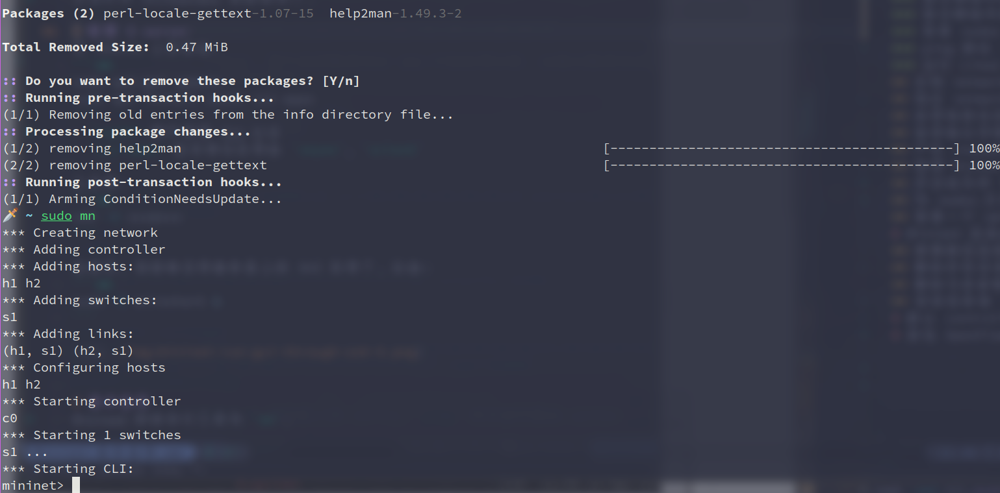
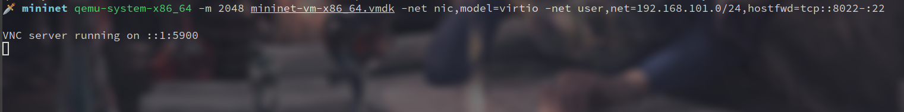
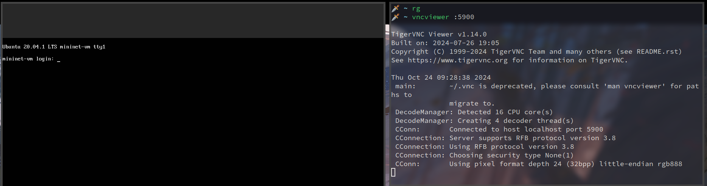
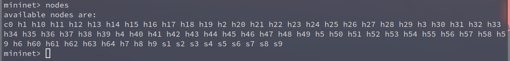
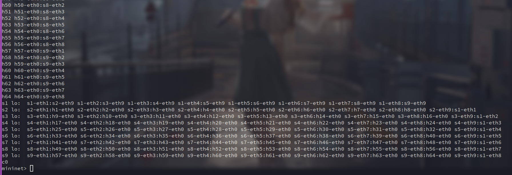
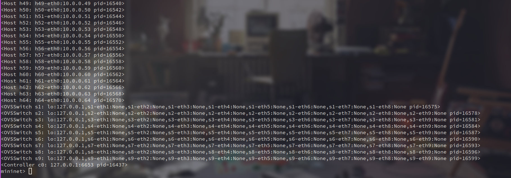
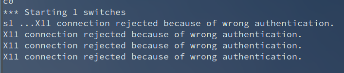
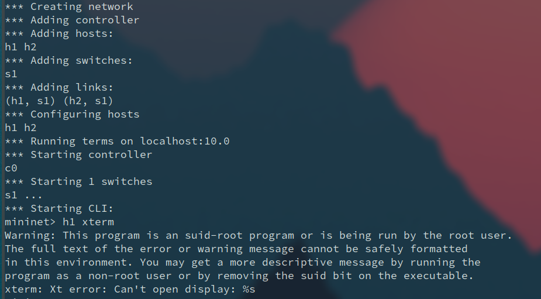
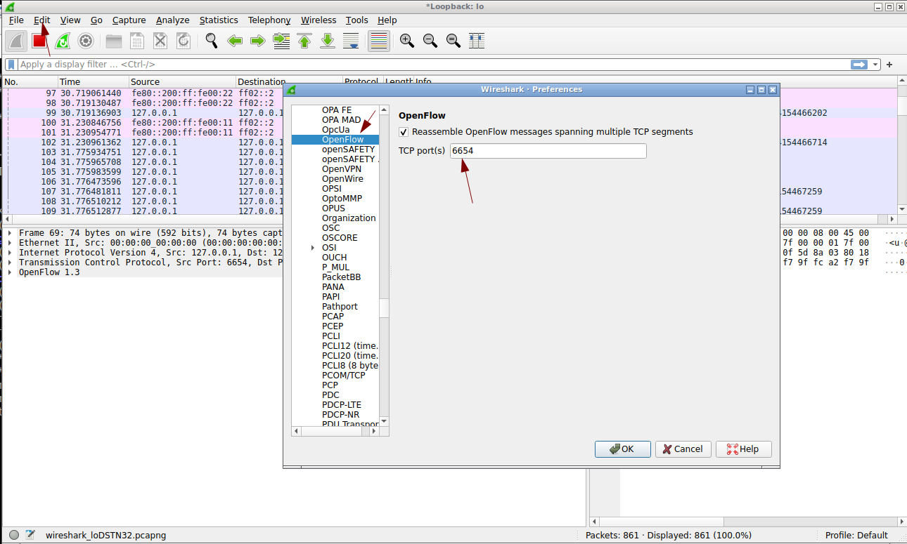
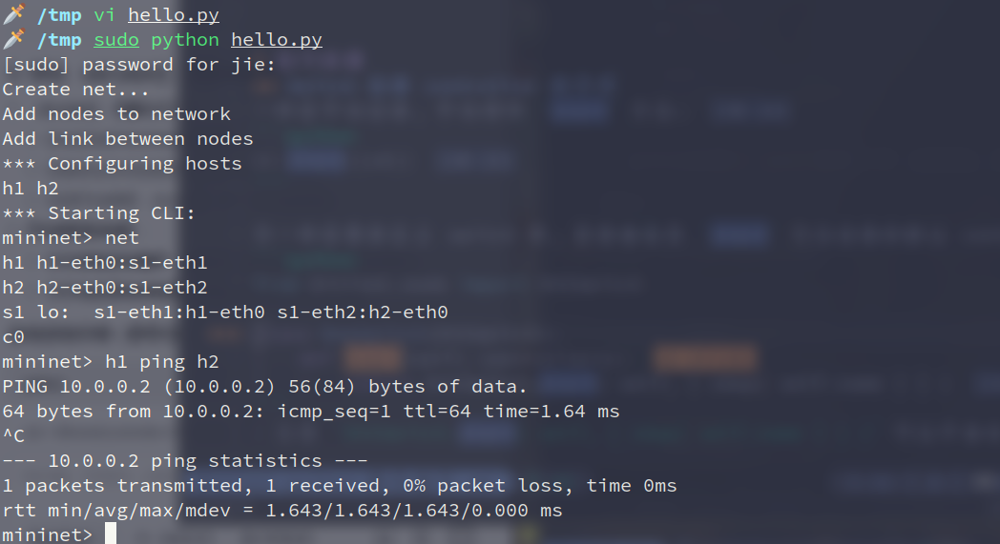

# Mininet
Mininet 可以在 Linux 内核上高效模拟真实的网络环境, 并可以用简单的命令构建复杂的网络拓扑, 常用于 SDN 的研究.

# 安装
完整安装文档可见 [Mininet Github 页面](https://github.com/mininet/mininet/blob/master/INSTALL).

## 软件包
在 Archlinux 上, 可以通过 AUR 安装:
```sh
yay -S mininet
```

安装过程可能有报错, 按照报错提示解决即可:



## 虚拟机
最简单的方式是使用官方打包好的虚拟机镜像, 不仅含 mininet, 还有 OpenFlow 及其工具集. 这里搭配 QUMU/KVM 做示例:


会得到一个压缩包, 将其解压后:
```sh
.
├── mininet-2.3.0-210211-ubuntu-20.04.1-legacy-server-amd64.ovf
├── mininet-2.3.0-210211-ubuntu-20.04.1-legacy-server-amd64-ovf.zip
└── mininet-vm-x86_64.vmdk
```

对于 QEMU/KVM, 可以运行:
```sh
qemu-system-x86_64 -m 2048 mininet-vm-x86_64.vmdk -net nic,model=virtio -net user,net=192.168.101.0/24,hostfwd=tcp::8022-:22
```

来启动 VNC 连接:



之后可用 `vncviewer` 连接:
```sh
vncviewer :5900
```



默认用户是 `mininet`, 密码 `mininet`.

# 基本使用
Mininet 的命令行工具为 `mn`.

## 清理遗留组件
每次用 `sudo mn` 启动网络时, 它仅仅创建一个临时的网络拓扑, 在退出后会清理. 也可以手动清理所有遗留组件:
```sh
sudo mn -c
```

## 测试两主机宽带可用
默认情况下, `mn` 的 topology 是一个 switch 连接两个 hosts. 测试两个主机间的宽带可用:
```sh
sudo mn --test iperf
```

## 创建一个 network
```sh
sudo mn --switch ovs --controller ref --topo tree,depth=2,fanout=8 --test pingall
```
- `--switch ovs`, 指定交换机类型为 ovs (Open vSwitch, 一个高性能, 可编程的虚拟交换机)
- `--controller ref`, 指定 `ref` (一个默认的控制器实现) 作为 SDN 控制器
- `--topo tree,depth=2,fanout=8`, 指定网络的拓扑结构, 这里指定为树形, 深度为 2, 每个非叶节点连接 8 个子节点 (一共 64 hosts 以及 9 各 switches)
- `--test pingall`, 会让所有虚拟主机互相发送 ping 命令, 测试相互之间是否连通 (不加这个能直接进入交互)

## 与 network 交互
### 显示网络中的所有 nodes
包括主机和交换机:
```sh
mininet> nodes
```



### 显示网络中的所有 net
```sh
mininet> net
```



### 查看 nodes 的所有信息
```sh
mininet> dump
```




### ping 测试
比如让一台 host 去 ping 另一台:
```sh
mininet> h2 ping h3
```

测试所有节点间的联通:
```sh
mininet> pingall
```


### 运行 Linux 命令
比如开启一个 http server, 让另一台 host 访问:
```sh
mininet> h2 ifconfig -a
mininet> h2 python -m SimpleHTTPServer 80 >& /tmp/http.log &
mininet> h3 wget -O - h2
```

## 指定 network topology
用 `--topo` 加上参数即可:
```sh
sudo mn --test pingall --topo linear,4
```

## 设置链路信息
用 `--link` 加上参数:
```sh
sudo mn --link tc,bw=10,delay=10ms
```
- `tc` 指使用 Traffic Control 机制来模拟链路特性
- `bw=10` 设置 bandwidth 为 10Mbps
- `delay=10ms` 在链路中引入 10ms 的延迟

此时:
```sh
mininet> iperf
...
mininet> h1 ping -c10 h2
```

会发现 `iperf` 的输出为 10Mbps 左右, RTT (Round Trip Time) 大概为 40ms. (因为有两条 link, 每个 link 10ms, 来回是 40ms)

## 改变输出详细程度
用 `-v` (verbose) 指定, 默认 verbosity level 是 `info`, 可以指定为 `debug`, `warning`, `output` 等:
```sh
sudo mn -v debug
```

## 产生 readable 的 mac 地址
默认情况下, mininet 启用的 hosts 是随机分配的 MAC 地址, 比如:
```sh
sudo mn
...
mininet> h1 ifconfig
h1-eth0: flags=4163<UP,BROADCAST,RUNNING,MULTICAST>  mtu 1500
        inet 10.0.0.1  netmask 255.0.0.0  broadcast 10.255.255.255
        ether f6:e6:11:d5:91:b2  txqueuelen 1000  (Ethernet)
        RX packets 0  bytes 0 (0.0 B)
        RX errors 0  dropped 0  overruns 0  frame 0
        TX packets 0  bytes 0 (0.0 B)
        TX errors 0  dropped 0 overruns 0  carrier 0  collisions 0

lo: flags=73<UP,LOOPBACK,RUNNING>  mtu 65536
        inet 127.0.0.1  netmask 255.0.0.0
        loop  txqueuelen 1000  (Local Loopback)
        RX packets 0  bytes 0 (0.0 B)
        RX errors 0  dropped 0  overruns 0  frame 0
        TX packets 0  bytes 0 (0.0 B)
        TX errors 0  dropped 0 overruns 0  carrier 0  collisions 0
```

如果启用 `--mac` 地址, 则能产生比较好读的 MAC 地址, 需要先确保 `openvswitch-switch` 是启用的:
```sh
sudo service openvswitch-switch start
```

之后:
```sh
sudo mn --mac
...
mininet> h1 ifconfig
h1-eth0: flags=4163<UP,BROADCAST,RUNNING,MULTICAST>  mtu 1500
        inet 10.0.0.1  netmask 255.0.0.0  broadcast 10.255.255.255
        ether 00:00:00:00:00:01  txqueuelen 1000  (Ethernet)
        RX packets 0  bytes 0 (0.0 B)
        RX errors 0  dropped 0  overruns 0  frame 0
        TX packets 0  bytes 0 (0.0 B)
        TX errors 0  dropped 0 overruns 0  carrier 0  collisions 0

lo: flags=73<UP,LOOPBACK,RUNNING>  mtu 65536
        inet 127.0.0.1  netmask 255.0.0.0
        loop  txqueuelen 1000  (Local Loopback)
        RX packets 0  bytes 0 (0.0 B)
        RX errors 0  dropped 0  overruns 0  frame 0
        TX packets 0  bytes 0 (0.0 B)
        TX errors 0  dropped 0 overruns 0  carrier 0  collisions 0
```

## 使用 Python Interpreter
在 Mininet CLI 交互中, 可以用 `py` 来运行 python 代码, 如:
```sh
mininet> py dir(s1)
```

## 开启或关闭 link
比如关闭交换机 `s1` 和主机 `h1` 之间的 link:
```sh
mininet> link s1 h1 down
```

若开启则:
```sh
mininet> link s1 h1 up
```

## 为 nodes 打开终端调试
这里要注意两点:
1. 用 ssh 连接时启用 `-X` (Enable X11 forwarding) 选项
2. 调用 `mn` 时启用 `-x` 选项

```sh
ssh -X mininet@xxxxx
sudo mn -x
```

之后:
```sh
mininet> h1 xterm
```

可能会遇到报错:





此时在启用时加上 `-E` 选项 (听说是环境变量没读到, 参考 [stackoverflow](https://stackoverflow.com/questions/38040156/xterm-not-working-in-mininet)).

```sh
sudo -E mn -x
...
mininet> h1 xterm
```


## 查看一个 switch 与哪个 controller 相连
```sh
mininet> sh ovs-vsctl get-controller s1
tcp:127.0.0.1:6635
```


# Mininet 流表处理
主要用 `dpctl` 命令 (Datapath Control):
```sh
mininet> dpctl <subcommand>
```

## 查看静态流表
```sh
mininet> dpctl dump-flows
```

## 删除所有流项
```sh
mininet> dpctl del-flows
```

## 删除与某参数相关的流表项
```sh
mininet> dpctl del-flows in_port=1
```

## 添加流表项
```sh
mininet> dpctl add-flow in_port=1,actions=output:2
mininet> dpctl add-flow in_port=2,actions=output:1
```

# 默认 controller 的使用
Mininet 中默认使用的 controller 来自 Open vSwitch 套件提供的 `controller` 命令, 其功能较为简单, 适合用于测试和演示.

基本使用如:
```sh
controller -v ptcp:6633
```
- `-v`, verbose, 启用详细的日志输出
- `ptcp:6633`, 指定监听的 TCP 端口

# 抓包 OpenFlow 协议包
需要配置 wireshark 端口:



之后:
```sh
mininet> sh wireshark &
```

选中 `lo` 即可.

若要筛选 `PacketIn` 包, 需要设置过滤器:
```
openflow_v4.type==10
```
- `openflow_v4`: 表示 `OpenFlow 1.3` 或更高版本

常见消息类型以及编号如下:
| 类型值 | 消息类型         | 描述                                                                 |
|--------|------------------|----------------------------------------------------------------------|
| 0      | `OFPT_HELLO`       | 用于握手，建立控制器与交换机之间的连接。                             |
| 1      | `OFPT_ERROR`       | 错误消息，用于报告协议或操作中的错误。                               |
| 2      | `OFPT_ECHO_REQUEST`| 用于测试控制器与交换机之间的连接。                                   |
| 3      | `OFPT_ECHO_REPLY`  | 对 `ECHO_REQUEST` 的响应。                                            |
| 4      | `OFPT_VENDOR`      | 厂商自定义消息。                                                     |
| 5      | `OFPT_FEATURES_REQUEST` | 控制器向交换机请求其支持的特性（如支持的流表数量）。                 |
| 6      | `OFPT_FEATURES_REPLY` | 交换机对 `FEATURES_REQUEST` 的响应，包含交换机的特性信息。           |
| 7      | `OFPT_GET_CONFIG_REQUEST` | 控制器向交换机请求其配置信息。                                     |
| 8      | `OFPT_GET_CONFIG_REPLY` | 交换机对 `GET_CONFIG_REQUEST` 的响应，包含配置信息。                |
| 9      | `OFPT_SET_CONFIG`  | 控制器向交换机发送配置信息。                                         |
| 10     | `OFPT_PACKET_IN`   | 交换机向控制器发送数据包（如未匹配流表的数据包）。                   |
| 11     | `OFPT_FLOW_REMOVED`| 交换机通知控制器某条流表项已被移除。                                 |
| 12     | `OFPT_PORT_STATUS` | 交换机通知控制器端口状态变化（如端口 up/down）。                      |
| 13     | `OFPT_PACKET_OUT`  | 控制器向交换机发送数据包，指示如何处理该数据包。                     |
| 14     | `OFPT_FLOW_MOD`    | 控制器向交换机添加、修改或删除流表项。                               |
| 15     | `OFPT_PORT_MOD`    | 控制器修改交换机端口的配置。                                         |
| 16     | `OFPT_STATS_REQUEST` | 控制器向交换机请求统计信息（如流表统计、端口统计等）。               |
| 17     | `OFPT_STATS_REPLY` | 交换机对 `STATS_REQUEST` 的响应，包含统计信息。                      |
| 18     | `OFPT_BARRIER_REQUEST` | 控制器向交换机发送屏障请求，确保之前的操作已完成。                  |
| 19     | `OFPT_BARRIER_REPLY` | 交换机对 `BARRIER_REQUEST` 的响应，表示之前的操作已完成。           |
| 20     | `OFPT_QUEUE_GET_CONFIG_REQUEST` | 控制器向交换机请求队列配置信息。                                   |
| 21     | `OFPT_QUEUE_GET_CONFIG_REPLY` | 交换机对 `QUEUE_GET_CONFIG_REQUEST` 的响应，包含队列配置信息。      |
| 22     | `OFPT_ROLE_REQUEST`            | 控制器向交换机请求或设置其角色（如主控制器、从控制器）。             |
| 23     | `OFPT_ROLE_REPLY`              | 交换机对 `ROLE_REQUEST` 的响应，包含角色信息。                       |
| 24     | `OFPT_GET_ASYNC_REQUEST`       | 控制器向交换机请求异步事件配置。                                     |
| 25     | `OFPT_GET_ASYNC_REPLY`         | 交换机对 `GET_ASYNC_REQUEST` 的响应，包含异步事件配置。              |
| 26     | `OFPT_SET_ASYNC`               | 控制器向交换机设置异步事件配置。                                     |
| 27     | `OFPT_METER_MOD`               | 控制器向交换机添加、修改或删除计量表项。                             |
| 28     | `OFPT_MULTIPART_REQUEST`       | 控制器向交换机请求多部分统计信息（如流表统计、端口统计等）。         |
| 29     | `OFPT_MULTIPART_REPLY`         | 交换机对 `MULTIPART_REQUEST` 的响应，包含多部分统计信息。            |

# Python API
可以通过 Python 接口, 编写自定义的网络拓扑结构. 一般通过官方的 example 脚本来学习:
```sh
git clone https://github.com/mininet/mininet
cd mininet/examples
```

## Hello World
```python
from mininet.net import Mininet
from mininet.log import info, setLogLevel
from mininet.cli import CLI

def run():
    info("Create net...\n")
    net = Mininet()

    info("Add nodes to network\n")
    h1 = net.addHost("h1")
    h2 = net.addHost("h2")
    s1 = net.addSwitch("s1")
    c0 = net.addController("c0")

    info("Add link between nodes\n")
    net.addLink(h1, s1)
    net.addLink(h2, s1)

    net.build()
    c0.start()
    s1.start([c0])
    CLI(net)
    net.stop()

if __name__ == "__main__":
    setLogLevel("info")
    run()
```
- 这里创建两个 host 连接一个 switch, 注意 switch 只有转发功能, 因此还要添加控制器.

启动:
```sh
sudo python hello.py
```




下面挨个解释:
```python
from mininet.net import Mininet

info("Create net...\n")
net = Mininet()
```
- `Mininet` 类的实例, 指代整个网络, 后续所有操作都是对该 net 进行修改, 比如添加 nodes, 添加 links, 启动 cli, 这里没传入任何参数

```python
from mininet.log import setLogLevel, debug, info, output, warning, error

def log_example():
    # 设置日志等级（例如改为 'debug' 可以看到所有等级的输出）
    setLogLevel('debug')

    # 打印不同等级的日志
    debug("This is a DEBUG message - details for developers\n")
    info("This is an INFO message - general progress\n")
    output("This is OUTPUT - important results\n")
    warning("This is a WARNING - potential issue\n")
    error("This is an ERROR - something went wrong\n")

if __name__ == "__main__":
    log_example()
```
- 用来设置日志输出等级, 等级列表如下:
    * `debug`
    * `info`
    * `output`
    * `warning`
    * `error`
- 你可以尝试修改不同的日志等级, 查看输出, 如:
    * `setLogLevel('debug')`, 会 `debug()` 以及更高等级输出的内容
    * `setLogLevel('info')`, 会输出 `info()` 以及更高等级输出的内容
    * 以此类推

```python
info("Add nodes to network\n")
h1 = net.addHost("h1")
h2 = net.addHost("h2")
s1 = net.addSwitch("s1")
c0 = net.addController("c0")

info("Add link between nodes\n")
net.addLink(h1, s1)
net.addLink(h2, s1)
```
- 先往网络中添加节点, 然后在节点间添加 link, 才能连通

```python
net.build()
c0.start()
s1.start([c0])
```
- `net.build()` 负责将 `addHost`, `addSwitch` 等添加进来的逻辑节点进行实例化, 比如, 创建 Linux 网络命名空间, 创建虚拟接口, 创建 `veth pair` 进行实际绑定等
- `c0.start()`, 启动控制器进程, 监听指定端口以等待交换机连接
- `s1.start([c0])`, 启动 Open vSwitch 守护进程, 并连接到指定控制器
- 这部分内容可以用 `net.start()` 来代替, 其自动调用 `net.build()` 以及内部节点的 `start` 方法

```python
CLI(net)
net.stop()
```
- `CLI(net)`, 用 `net` 信息启动一个交互界面
- `net.stop()` 进行清理工作
