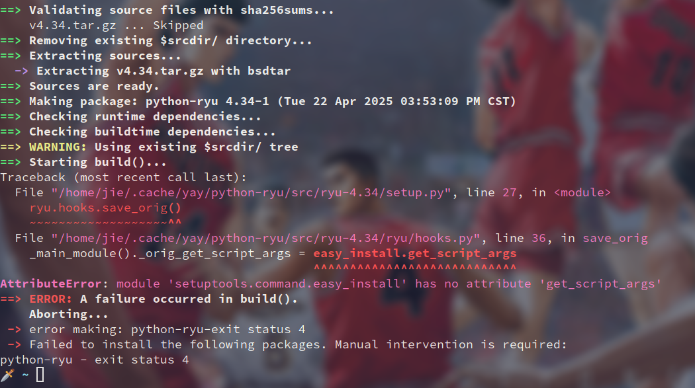
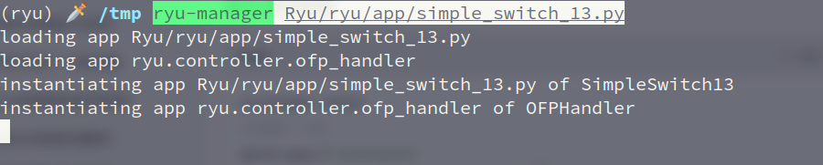
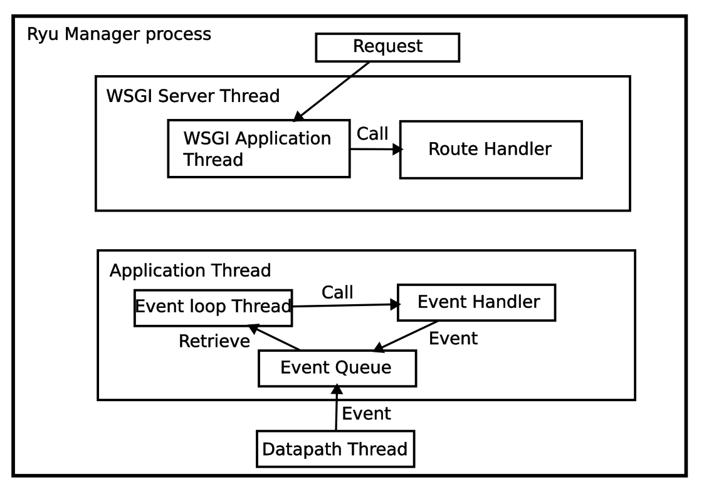

# Ryu
Ryu 是一个基于 Python 的开源 SDN (软件定义网络) 控制器框架, 用于管理和控制 OpenFlow 交换机. 详细的文档可以看 [Ryu 官方文档](https://ryu.readthedocs.io/en/latest/) 以及 Ryu book (自己找下资源只有).

# 安装
## 软件包
在 Archlinux 上, 可以通过 AUR 安装:
```sh
yay -S python-ryu
```

如果遇到下面报错:



解决办法为:
```sh
pip uninstall setuptools
pip install setuptools==67.6.1
yay -S python-ryu
```

由于各种依赖问题, 不太建议这种安装方式.

## pip (推荐)
最好用 `python3.8` 构建虚拟环境运行.

Archlinux 上管理多版本 python:
```sh
sudo pacman -S pyenv
echo 'export PYENV_ROOT="$HOME/.pyenv"' >> ~/.bashrc
echo 'export PATH="$PYENV_ROOT/bin:$PATH"' >> ~/.bashrc
echo 'eval "$(pyenv init --path)"' >> ~/.bashrc
source ~/.bashrc

pyenv install 3.8
pyenv global 3.8.xx
```
(xx 为你安装的具体版本, 我这里是 `20`)

构建 `venv` 虚拟环境:
```sh
python3.8 -m venv ryu
source ryu/bin/activate
pip install ryu
pip uninstall eventlet
pip install eventlet==0.30.0
ryu-manager --version
```

测试:
```sh
git clone https://github.com/faucetsdn/ryu.git Ryu
ryu-manager Ryu/ryu/app/simple_switch_13.py
```




# 结构


- WSGI 定义 REST API 作为北向接口
- `Application` 以 OpenFlow 作为南向接口与基础设备通信

Ryu Controller 的主要编写逻辑为:
- 定义继承自 `app_manager.RyuApp` 的类, 这是入口, 整个文件就是在完善这个类
- 利用 `set_ev_cls` 修饰器添加事件处理函数 (这个修饰器主要的作用就是为从函数传入的事件设置类别)

# ryu 库基本结构
```sh
git clone https://github.com/faucetsdn/ryu.git Ryu
cd Ryu/ryu
```

该目录下的文件, 就是编写 Ryu 控制器的所有接口库:
```sh
tree -L 1
.
├── app
├── base
├── cfg.py
├── cmd
├── contrib
├── controller
├── exception.py
├── flags.py
├── hooks.py
├── __init__.py
├── lib
├── log.py
├── ofproto
├── __pycache__
├── services
├── tests
├── topology
└── utils.py
```
`app` 目录下有许多官方的 `application` 示例, 后续也会作为例子介绍.

一些重要的接口, 比如:
- `ryu.base.app_manager` 库中的 `RyuApp` 类
- `ryu.controller.handler` 中的 `set_ev_cls` 修饰器
- `ryu.controller.ofp_event` 库, 包含一些事件类

# Hello World
假设工作目录为 `~/myRyu`:
```sh
cd ~/myRyu
mkdir hello_ryu.py
```

内容:
```python
from ryu.base import app_manager
import logging
logging.basicConfig(level=logging.DEBUG)

class L2Switch(app_manager.RyuApp):
    def __init__(self, *args, **kwargs):
        super(L2Switch, self).__init__(*args, **kwargs)
        logging.debug("Hello Ryu!")
```

运行:
```sh
ryu-manager --verbose hello_ryu.py
loading app hello_ryu.py
instantiating app hello_ryu.py of L2Switch
Hello Ryu!
BRICK L2Switch
```

- 这里 `ryu-manager` 以继承自 `app_manager.RyuApp` 的类为入口
- `super(L2Switch, self).__init__(*args, **kwargs)` 将参数传递给父类的 `__init__` 函数来初始化, `*args` 捕获所有位置参数, `**kwargs` 捕获所有命名参数
- `super` 函数的语法如下:
```python
super(ChildClass, self).method(args)
```
- `ChildClass` 表明从哪个类开始查找父类
- `self` 指明用哪个实例来调用父类的方法

# OpenFlow 版本协商
大多时候, 可以显示指定使用的 OpenFlow 版本:

```python
from ryu.ofproto import ofproto_v1_0

class L2Switch(app_manager.RyuApp):
    OFP_VERSIONS = [ofproto_v1_0.OFP_VERSION]
    ...
```
(完整示例在 `./codes/hello_ofp_version.py` 文件)

- `ofproto_v1_0` 库, 指 `ryu/ofproto/ofproto_v1_0.py` 文件, 该文件中定义了一系列与 OpenFlow v1.0 相关的常量, 如:
    * OpenFlow v1.0 版本: `OFP_VERSION = 0x01`
    * 消息类型, 如 `OFPT_HELLO = 0`, `OFPT_SET_CONFIG = 9`
    * Command 类型, 如 `OFPFC_ADD = 0`, `OFPFC_DELETE = 3`
    * Action 类型, 如 `OFPAT_OUTPUT = 0`
- `OFP_VERSION` 类变量 (列表, 可以指定多个版本) 会被 `ryu-manager` 自动读取

# `xxx_DISPATCHER`
`xxx_DISPATCHER` 定义在 `ryu/controller/handler.py` 文件中, 指的是 OpenFlow 通信的阶段, 每个阶段会发生不同的事件, 包括下面 4 个 (阶段按顺序进行):
- `HANDSHAKE_DISPATCHER`, 握手阶段, 有 `EventOFPHello` 等
- `CONFIG_DISPATCHER`, 配置阶段, 有 `EventOFPSwitchFeatures`, `EventOFPSetConfig` 等
- `MAIN_DISPATCHER`, 主调度阶段 (正常工作状态), 有 `EventOFPPacketIn`, `EventOFPPortStatus` 等
- `DEAD_DISPATCHER`, 断开连接阶段, 有 `EventOFPStateChange` 等

这些事件类 (如 `EventOFPSwitchFeatures`) 定义在 `ryu/controller/ofp_event.py` 中, 但大部分类是通过消息名动态生成的, 如 `OFP_HELLO` 消息对应 `EventOFPHello` 类, `OFP_SET_CONFIG` 对应 `EventOFPSetConfig`.

Ryu 控制器是事件驱动 (事件触发时由对应函数处理), 需要指定事件并绑定 handler 函数来处理. 这里需要用到 `ryu/controller/handler.py` 中定义的 `set_ev_cls` 修饰器, 语法如:
```python
from ryu.controller import ofp_event
from ryu.controller.handler import set_ev_cls

class xxx:
    ...
    @set_ev_cls(ofp_event.EventOFPPacketIn, MAIN_DISPATCHER)
    def xxx_handler(self, ev):
        pass
```
- 最重要的是 `ev` 参数, 其代表该事件类 (比如这里是 `EventOFPPacketIn`), 含消息体, datapath 等信息

所有的事件消息类, 都继承自 `ryu/controller/ofp_event.py` 中定义的 `EventOFPMsgBase` 类, 包含 2 个成员:
- `msg`, 一个 OpenFlow message 实例, 继承自 `ryu/ofproto/ofproto_parser.py` 中定义的 `MsgBase`, 主要成员有:
    * `datapath`, 一个 `ryu.controller.controller.Datapath` 实例
    * `version`, OpenFlow protocol 的版本信息
    * `msg_type`, OpenFlow message 的类型, 定义在 `ofproto/ofproto_v1_3.py` 文件, 前缀为 `OFPT` (大概)
    * `msg_len`, 消息长度
    * `xid`, transaction id
    * `buf`, Raw data
- `timestamp`, Datapath 实例创建的时间戳

# `OFP_HELLO` Example
这里用 Open vSwitch, Ryu 做一个 `OFP_HELLO` 事件的演示, 该事件仅用于建立底层 TCP 连接, 确认通信双方支持的最低 OpenFlow 版本, `OFP_HELLO` 消息本身是一个空消息 (或仅包含基础头部), 不携带版本号或其他配置信息.

实际的版本协商是通过后续的 `OFPT_FEATURES_REQUEST/REPLY` 完成的 (在 `CONFIG_DISPATCHER` 阶段).


准备工作如下:
```sh
sudo systemctl start ovs-vswitchd.service
sudo systemctl start ovsdb-server
sudo ovs-vsctl add-br ovs-br0
```

Ryu 控制器代码:
```python
from ryu.base import app_manager
from ryu.controller import ofp_event
from ryu.controller.handler import set_ev_cls, HANDSHAKE_DISPATCHER
from ryu.ofproto import ofproto_v1_0
import logging

logging.basicConfig(level=logging.DEBUG)
class L2Switch(app_manager.RyuApp):
    OFP_VERSION = [ofproto_v1_0.OFP_VERSION]
    def __init__(self, *args, **kwargs):
        super(L2Switch, self).__init__(*args, **kwargs)
        logging.debug("Hello Ryu Init!")

    @set_ev_cls(ofp_event.EventOFPHello, HANDSHAKE_DISPATCHER)
    def hello_handler(self, ev):
        datapath = ev.msg.datapath
        logging.debug(f"In OFP_HELLO Handler")
```

之后运行:
```sh
ryu-manager --verbose --ofp-tcp-listen-port 6654 hello_msg_test.py
sudo ovs-vsctl set-controller ovs-br0 tcp:127.0.0.1:6654
```

输出:
```
...
connected socket:<eventlet.greenio.base.GreenSocket object at 0x74d55e29fa30> address:('127.0.0.1', 35298)
EVENT ofp_event->L2Switch EventOFPHello
hello ev <ryu.controller.ofp_event.EventOFPHello object at 0x74d55e2f63d0>
move onto config mode
In OFP_HELLO Handler
switch features ev version=0x6,msg_type=0x6,msg_len=0x20,xid=0x937b4ea6,OFPSwitchFeatures(auxiliary_id=0,capabilities=591,datapath_id=117111234183759,n_buffers=0,n_tables=254)
move onto main mode
```

这里也可以看到 DPID 的获取以及 OpenFlow 具体版本的协商是在 `CONFIG_DISPATCHER` 阶段, 通过 switch feature 获得.

# EventOFPSwitchFeatures Example
同样用 Open vSwitch 做演示 (如果没有创建的话):
```sh
sudo systemctl start ovs-vswitchd.service
sudo systemctl start ovsdb-server
sudo ovs-vsctl add-br ovs-br0
```

Ryu 控制器代码:
```python
from ryu.base import app_manager
from ryu.controller import ofp_event
from ryu.controller.handler import set_ev_cls, CONFIG_DISPATCHER
from ryu.ofproto import ofproto_v1_0
import logging

logging.basicConfig(level=logging.DEBUG)

class L2Switch(app_manager.RyuApp):
    OFP_VERSION = ofproto_v1_0
    def __init__(self, *args, **kwargs):
        super(L2Switch, self).__init__(*args, **kwargs)
        logging.debug("Hello Ryu Init!")

    @set_ev_cls(ofp_event.EventOFPSwitchFeatures, CONFIG_DISPATCHER)
    def switch_feature_handler(self, ev):
        msg = ev.msg
        datapath = msg.datapath
        logging.debug(f"In OFP_Switch_Feature: {datapath.id}")
```

之后运行:
```sh
ryu-manager --verbose --ofp-tcp-listen-port 6654 switch_feature_test.py
sudo ovs-vsctl set-controller ovs-br0 tcp:127.0.0.1:6654
```

输出:
```
...
move onto config mode
EVENT ofp_event->L2Switch EventOFPSwitchFeatures
switch features ev version=0x6,msg_type=0x6,msg_len=0x20,xid=0x499ce0ef,OFPSwitchFeatures(auxiliary_id=0,capabilities=591,datapath_id=117111234183759,n_buffers=0,n_tables=254)
In OFP_Switch_Feature: 117111234183759
move onto main mode
```

## 添加 Table miss 流表项
在 switch feature 阶段, 一般用来设置 table miss 流表项 (默认流表项, 当啥都没匹配到时触发), 代码如下:
```python
@set_ev_cls(ofp_event.EventOFPSwitchFeatures, CONFIG_DISPATCHER)
def switch_features_handler(self, ev):
    datapath = ev.msg.datapath
    ofproto = datapath.ofproto
    parser = datapath.ofproto_parser

    match = parser.OFPMatch()
    actions = [parser.OFPActionOutput(ofproto.OFPP_CONTROLLER,
                                      ofproto.OFPCML_NO_BUFFER)]
    inst = [parser.OFPInstructionActions(ofproto.OFPIT_APPLY_ACTIONS,
                                            actions)]
    if buffer_id:
        mod = parser.OFPFlowMod(datapath=datapath, buffer_id=buffer_id,
                                priority=priority, match=match,
                                instructions=inst)
    else:
        mod = parser.OFPFlowMod(datapath=datapath, priority=0,
                                match=match, instructions=inst)
    datapath.send_msg(mod)
```
- `datapath` 是 `ryu.controller.controller.Datapath` 对象, 表示 controller 与一个 openflow switch 的连接信息, 其成员有:
    * `id`, `64` 位 10 进制数表示的 Datapath ID
    * `ofproto`, 导入的 `ryu.ofproto.ofproto_v1_x` 模块
    * `ofproto_parser`, 导入的 `ryu.ofproto.ofproto_parser` 模块
- `ofproto` 模块中定义了与 OpenFlow 秀逸相关的常量和数据结构, 这里用到了:
    * `ofproto.OFPP_CONTROLLER`, 指定与 controller 连接的端口
    * `ofproto.OFPCML_NO_BUFFER`, 表示没有要直接处理的数据包
    * `ofproto.OFPIT_APPLY_ACTIONS`, 表示立即执行 Actions
- `ofproto_parser` 模块, 用于创建流表匹配项, Action 等类的实例:
    * `OFPMatch` 类, 用于流表匹配, 这里为空, 表示空匹配
    * `OFPActionOutput` 类, 输出动作, 需要指定输出端口和数据包长度
    * `OFPInstructionActions` 类, 指定对一组 actions 的 instruction, 即如何执行这一组 actions
    * `OFPFlowMod` 类, 修改流表项

一个基本的流程就是:
- 创建匹配项
- 创建 Actions
- 创建 Instruction
- 创建 OFPFlowMod 消息
- 发送 OFPFlowMod 消息

完整程序如下:
```python
from ryu.base import app_manager
from ryu.controller import ofp_event
from ryu.controller.handler import set_ev_cls, CONFIG_DISPATCHER
from ryu.ofproto import ofproto_v1_0
import logging

logging.basicConfig(level=logging.DEBUG)

class L2Switch(app_manager.RyuApp):
    OFP_VERSION = ofproto_v1_0
    def __init__(self, *args, **kwargs):
        super(L2Switch, self).__init__(*args, **kwargs)
        logging.debug("Hello Ryu Init!")
    
    @set_ev_cls(ofp_event.EventOFPSwitchFeatures, CONFIG_DISPATCHER)
    def switch_features_handler(self, ev):
        datapath = ev.msg.datapath
        ofproto = datapath.ofproto
        parser = datapath.ofproto_parser

        buffer_id = None
        match = parser.OFPMatch()
        actions = [parser.OFPActionOutput(ofproto.OFPP_CONTROLLER,
                                        ofproto.OFPCML_NO_BUFFER)]
        inst = [parser.OFPInstructionActions(ofproto.OFPIT_APPLY_ACTIONS,
                                                actions)]
        logging.debug("Send mod msg...")
        
        if buffer_id:
            mod = parser.OFPFlowMod(datapath=datapath, buffer_id=buffer_id,
                                    priority=0, match=match,
                                    instructions=inst)
        else:
            mod = parser.OFPFlowMod(datapath=datapath, priority=0,
                                    match=match, instructions=inst)
        datapath.send_msg(mod)
        logging.debug("Fin send mod msg...")
```

运行:
```sh
ryu-manager --verbose --ofp-tcp-listen-port 6654 mod_flow_test.py
sudo ovs-vsctl set-controller ovs-br0 tcp:127.0.0.1:6654
```

输出:
```
...
connected socket:<eventlet.greenio.base.GreenSocket object at 0x7c49c6294a30> address:('127.0.0.1', 33538)
hello ev <ryu.controller.ofp_event.EventOFPHello object at 0x7c49c62eb400>
move onto config mode
EVENT ofp_event->L2Switch EventOFPSwitchFeatures
switch features ev version=0x6,msg_type=0x6,msg_len=0x20,xid=0x779bada7,OFPSwitchFeatures(auxiliary_id=0,capabilities=591,datapath_id=117111234183759,n_buffers=0,n_tables=254)
Send mod msg...
Fin send mod msg...
move onto main mode
```

用 `ovs` 工具集查看:
```sh
sudo ovs-ofctl dump-flows ovs-br0
```

输出:
```
 cookie=0x0, duration=53.595s, table=0, n_packets=0, n_bytes=0, priority=0 actions=CONTROLLER:65535
```
